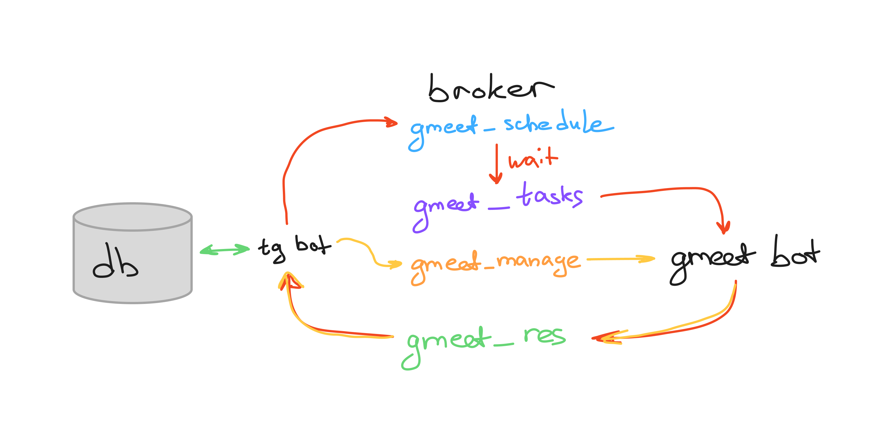

# 🌟 Conferee: Ваш умный помощник для Google Meet конференций

**Conferee** — это мощный и гибкий инструмент для автоматизации записи, управления и поиска конференций в Google Meet. Состоящий из трёх ключевых компонентов — **GMeetBot**, **ConfereeTgBot** и **RabbitMQService**, он превращает хаос видеоконференций в структурированный и удобный процесс. Хотите записывать встречи, сортировать их по тегам и легко находить нужную запись? Conferee справится с этим на ура! 🚀

## 📖Содержание
- [🌟 Conferee: Ваш умный помощник для Google Meet конференций](#-conferee-ваш-умный-помощник-для-google-meet-конференций)
  - [📖Содержание](#содержание)
  - [Что такое Conferee?](#что-такое-conferee)
  - [Компоненты Conferee](#компоненты-conferee)
    - [1. GMeetBot 🎥](#1-gmeetbot-)
    - [2. ConfereeTgBot 🤖](#2-confereetgbot-)
    - [3. RabbitMQService 📬](#3-rabbitmqservice-)
  - [Архитектура](#архитектура)
  - [Ключевые возможности](#ключевые-возможности)
  - [Как это работает?](#как-это-работает)
  - [Зачем вам Conferee?](#зачем-вам-conferee)

## Что такое Conferee?

Conferee помогает пользователям:
- 📹 **Автоматически записывать конференции Google Meet** без лишних усилий.
- 🏷️ **Структурировать записи по тегам** для быстрого доступа.
- 🔍 **Находить записи** по тегу или прямой ссылке на встречу.
- ⚙️ **Гибко управлять тегами**: создавать, редактировать, просматривать, архивировать (с возможностью восстановления) и удалять.
- 🏃‍♂️ **Умно завершать запись**: GMeetBot автоматически покидает встречу, если других участников не осталось.

Это идеальный инструмент для команд, преподавателей, организаторов мероприятий и всех, кто хочет держать свои видеоконференции под контролем!

## Компоненты Conferee

### 1. GMeetBot 🎥
- **Кто это**: Бот, который подключается к Google Meet и записывает всё, что происходит.
- **Суперсила**:
  - Автоматически присоединяется к встречам по расписанию.
  - Записывает видео и сохраняет их для дальнейшего использования.
  - Уходит из встречи, если остался один — никаких пустых записей! 😅

### 2. ConfereeTgBot 🤖
- **Кто это**: Telegram-бот, ваш личный интерфейс для управления записями и тегами.
- **Суперсила**:
  - 🔎 Поиск записей по тегам или ссылкам.
  - 🏷️ Управление тегами: создание, редактирование, архивация и удаление с восстановлением.
  - 📲 Удобный доступ через Telegram — всё под рукой!
  - Поддержка ролей (пользователь, админ, владелец) для гибкого контроля.

### 3. RabbitMQService 📬
- **Кто это**: Брокер сообщений, связывающий GMeetBot и ConfereeTgBot.
- **Суперсила**:
  - Быстрая и надёжная передача задач между ботами.
  - Координация действий: от запуска записи до уведомлений о завершении.
  - Держит всё в синхронизации, как дирижёр оркестра! 🎻

## Архитектура

## Ключевые возможности

| Функция                        | Описание                                                                 |
|--------------------------------|--------------------------------------------------------------------------|
| **Автоматическая запись**      | GMeetBot подключается к Google Meet и записывает всё без вашего участия. |
| **Управление тегами**          | Создавайте, редактируйте, архивируйте и удаляйте теги через Telegram.    |
| **Поиск записей**              | Находите нужную запись по тегу или ссылке за пару кликов.               |
| **Умный выход**                | Бот покидает встречу, если никого не осталось — экономия ресурсов!       |
| **Гибкость и структура**       | Организуйте конференции так, как вам удобно, с помощью тегов.           |

## Как это работает?

1. **Запись**: Вы задаёте встречу через ConfereeTgBot, и RabbitMQService отправляет задачу GMeetBot.
2. **Участие**: GMeetBot подключается к Google Meet и начинает запись.
3. **Управление**: Через Telegram вы добавляете теги, ищете записи или управляете ими.
4. **Завершение**: Если участников больше нет, GMeetBot автоматически завершает запись и уведомляет вас.

Всё просто, быстро и без лишних телодвижений! 😎

## Зачем вам Conferee?

- **Для команд**: Храните записи встреч в порядке и легко находите нужное обсуждение.
- **Для преподавателей**: Записывайте лекции и семинары, сортируйте их по темам.
- **Для всех**: Автоматизируйте рутину и сосредоточьтесь на главном!

Conferee — это не просто боты, это ваш надёжный союзник в мире видеоконференций. Попробуйте и убедитесь сами! 💪
